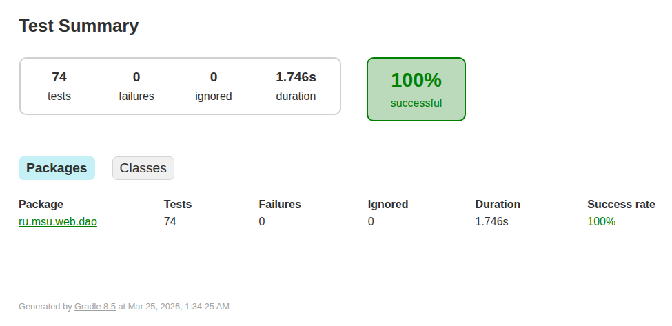
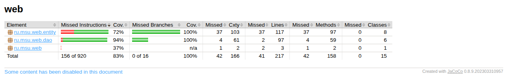

# Зарплатная ведомость

## Содержание

- [Вариант 8](#var)
- [Схема Навигации](#pagesscheme)
- [Описание страниц](#pagesdescription)
- [Сценарии Использования](#usecases)
- [Схема БД](#dbscheme)
- [Сборка](#gradle)

- [BackEnd](#backend)

- [FrontEnd](#front)

----------------------

## Вариант 8

### Система управления информацией о зарплатах служащих компании.

### Поддерживаемые данные

- Служащие
  - ФИО
  - Домашний адрес
  - Дата рождения
  -  Образование
  - Стаж работы в компании
  - Текущая должность
  - Участие в проектах и выполняемые роли
  - История занимаемых должностей и участия в проектах проектов
  - Общая история всех выплат
  - Премии и даты их выписки
- Проекты
  - Название, даты начал и окончания
  - Роли в проекте (руководитель, аналитик, секретарь, эксперт)
- Политики выплат
  - По должностям
  - По проектам и ролям
  - За стаж
  - Премиальные на Новый год, дни рождения, круглые даты в истории компании

### Поддерживаемые операции

-  Получение списка служащих, в т.ч. по должностям, проектам, стажу, премированных и пр.
-  Получение истории участия в проектах и карьерной истории для служащего
-  Получение истории выплат для служащего
-  Назначение служащего на новую должность, добавление в/удаление из проекта
-  Добавление и удаление служащего, чтение и редактирование данных о нем
-  Добавление и удаление проекта, чтение и редактирование данных о нем
-  Добавление и удаление политик выплат, чтение и редактирование данных о них

-------------

## Схема навигации

## Описание страниц

На всех страницах в шапке присутсвтует ссылка на [Главную страницу](#pg_dashdoard)

#### Главная страница

1. Ссылка на [Список сотрудников](#pg_employees)
2. Ссылка на [Список проектов](#pg_projects)
3. Ссылка на [Историю начислений](#pg_transactions)
4. Ссылка на [Политики выплат](#pg_policies)

#### Список сотрудников

Содержит информацию о всех сотрудниках компании (ту, что содержится в таблице Emplyyes в базе данных). Также присутсвуют архивные записи об уволенных сотрудниках

1. Кнопка фильтрации:
   - По ФИО (Полнотекстовый поиск)
   - По стажу работы (диапазон)
   - По текущей должности
   - По участию в проекте
   - По статусу (действующий/уволенный)
2. Режим сортировки:
   - По ФИО (А-Я, Я-А)
   - По дате приема на работу
   - По дате рождения
   - По текущей должности
   - По количеству проектов
3. При нажатии на конкретного сотрудника происходит переход на его карточку в [Информации о сотрудниках](#pg_emp_info)
4. Кнопка добавить служащего - также перенаправляет на страницу [Информация о сотрудниках](#pg_emp_info). Все поля пустые, новый сотрудник не попадает в базу до заполнения всех полей

#### Список проектов 

Содержит информацию о всех проектах компании (в т.ч. должностей, не относящихся к конкретным проектам)

1. Кнопка фильтрации:
   - По названию
   - По дате начала (диапазон)
   - По дате окончания (диапазон)
   - По статусу (активный/завершённый/архивный)
2. Режим сортировки:
   - По названию (А-Я, Я-А)
   - По дате начала
   - По дате окончания
3. При нажатии на конкретный проект происходит переход на его карточку в [Информации о проектах](#pg_proj_info)
4. Кнопка добавить проект - также перенаправляет на страницу [Информация о проектах](#pg_proj_info). Все поля пустые, новый проект не попадает в базу до заполнения всех полей
5. Поиск по названию

#### История начислений

Все начисления зарплат/премий конкретным сотрудникам

1. Кнопка фильтрации:
   - По дате выплаты (диапазон)
   - По размеру выплаты (диапазон)
   - По типу выплаты (зарплата, премия, бонус, и т.д.)
   - По сотруднику
   - По политике выплаты
2. Режим сортировки:
   - По дате выплаты
   - По размеру выплаты
   - По ФИО сотрудника

Данные можно редактировать

#### Политики выплат

Политики выплат компании, связанные с премиями, проектам и т.д.

1. Кнопка фильтрации:
   - По типу политики (salary, seniority, calendar_bonus, one_time_bonus)
   - По размеру выплаты (диапазон)
   - По проекту
   - По должности
   - По минимальному стажу (для типа seniority)
   - По событию/поводу (для calendar_bonus, one_time_bonus)
2. Режим сортировки:
   - По размеру выплаты
   - По минимальному стажу

Данные можно редактировать

#### Информация о сотруднике

Информация о конкретном сотруднике:

- ФИО
- Контактная информация
- Участие в проектах компании и должности на этих проектах (с датами)
- Стаж работы
- Прочая информация, связанная с сотрудником

Здесь без фильтрации и сортировки, удобнее будет действующие/архивные записи помечать разными цветами

Данные о сотрудниках можно редактировать вручную

Присутствует кнопка перехода на страницу [История начислений](#pg_transactions), в которой уже будут применены фильтры по данному сотруднику

#### Информация о проекте

Информация о конкретном проекте:

- Название
- Дата начала
- Статус проекта
- Список сотрудников и их должностей, которые относятся (или относились раньше) к проекту

Аналогично, действующих и архивных сотрудников проекта помечаем разными цветами вместо лишнего интерфейса 

Данные о проектах можно редактировать вручную

По кнопке можно перейти на страницу [Политики выплат](#pg_policies), в которой уже будет фильтрация по данному проекту

Также есть кнопка добавить сотрудника, после которой отроется меню выбора сотрудника и должности в проекте, на которую его нужно назначить

## Сценарии использования

### 1. Добавление нового сотрудника
1. Главная страница
2. Нажать "Список сотрудников"
3. Нажать кнопку "Добавить сотрудника"
4. Заполнить все необходимые поля:
   - ФИО, дата рождения, образование
   - Домашний адрес
   - Контактная информация
   - Дата приема на работу
5. Нажать "Сохранить" -> Сотрудник добавлен в систему

### 2. Просмотр истории участия в проектах для конкретного сотрудника
1. Главная страница
2. Нажать "Список сотрудников"
3. Использовать поиск по ФИО или фильтр по фамилии
4. Нажать на нужного сотрудника
5. На странице "Информация о сотруднике" просмотреть раздел "Участие в проектах":
   - Текущие проекты и роли
   - Архив: бывшие проекты с датами начала и окончания
   - Должности на каждом проекте

### 3. Назначение сотрудника на проект с определенной должностью
1. Главная страница
2. Нажать "Список проектов"
3. Кликнуть на нужный проект
4. На странице "Информация о проекте" нажать кнопку "Добавить сотрудника"
5. В появившемся меню:
   - Выбрать сотрудника из списка (с поиском)
   - Выбрать должность в проекте (руководитель, аналитик, секретарь, эксперт)
   - Указать дату начала работы
6. Нажать "Подтвердить" -> Сотрудник добавлен в проект

### 4. Изменение контактной информации сотрудника
1. Главная страница
2. Нажать "Список сотрудников"
3. Найти и кликнуть на нужного сотрудника
4. На странице "Информация о сотруднике" в разделе "Контактная информация":
   - Отредактировать/добавить номер телефона
   - Отредактировать/добавить email
   - Отредактировать домашний адрес
5. Нажать "Сохранить" -> Данные обновлены

### 5. Изменение должности сотрудника
1. Главная страница
2. Нажать "Список сотрудников"
3. Найти и кликнуть на нужного сотрудника
4. На странице "Информация о сотруднике" найти кнопку "Изменить должность"
5. Выбрать новую должность из списка доступных должностей/проектов
6. Указать дату вступления в должность
7. Нажать "Применить" -> История должностей обновлена, текущая должность изменилась

### 6. Удаление сотрудника из проекта
1. Главная страница
2. Способ A: Через проект
   - Нажать "Список проектов"
   - Выбрать проект
   - На странице проекта найти сотрудника в списке
   - Нажать кнопку "Удалить" рядом с ним
   - Указать дату окончания работы (или текущую дату)
3. Способ B: Через карточку сотрудника
   - Нажать "Список сотрудников"
   - Выбрать сотрудника
   - На странице "Информация о сотруднике" в списке проектов нажать "Удалить из проекта"
4. Нажать "Подтвердить" -> Запись переместилась в архив проекта для данного сотрудника

### 7. Составление ведомости к выплате зарплат (Отчет по сотрудникам)
1. Главная страница
2. Нажать "История начислений"
3. Применить фильтры:
   - **По типу выплаты**: Выбрать "Зарплата"
   - **По дате выплаты**: Указать начало и конец периода (месяца/квартала)
   - (Опционально) **По проекту**: Если нужна ведомость конкретного проекта
4. Данные отчета должны содержать:
   - ФИО сотрудника
   - Должность
   - Оклад (размер выплаты за период)
   - Дата выплаты
   - Проект (если применяется)
5. (Опционально) Экспортировать в файл/печать
6. На основе отчета:
   - Подготовить ведомость для бухгалтерии
   - Проверить правильность начислений
   - Выявить недоплаты или переплаты

### 8. Анализ премиальных начислений (Отчет по премиям)
1. Главная страница
2. Нажать "История начислений"
3. Применить фильтры:
   - **По типу выплаты**: Выбрать "Премия" или "Бонус"
   - **По дате выплаты**: Указать нужный период
   - (Опционально) **По сотруднику**: Для анализа премий конкретного лица
4. Данные отчета должны содержать:
   - ФИО сотрудника
   - Тип премии (праздничная/за достижения/за стаж)
   - Размер премии
   - Дата выплаты
   - Причина/повод
5. На основе отчета:
   - Проанализировать объем премирования
   - Выявить наиболее часто премируемых сотрудников
   - Проверить соответствие политикам выплат

### 9. Составление отчета по расходам на сотрудника
1. Главная страница
2. Нажать "История начислений"
3. Применить фильтры:
   - **По сотруднику**: Выбрать конкретного сотрудника
   - **По дате выплаты**: Указать период (весь год или квартал)
4. Данные отчета должны содержать для выбранного сотрудника:
   - Итоговая сумма зарплаты за период
   - Итоговая сумма премий за период
   - Итоговая сумма бонусов за период
   - Полная сумма расходов на сотрудника
5. На основе отчета:
   - Рассчитать среднемесячные расходы
   - Сравнить с предыдущими периодами
   - Оценить ROI сотрудника

### 10. Проверка правильности политик выплат
1. Главная страница
2. Нажать "Политики выплат"
3. Применив фильтры по необходимости:
   - **По типу**: Осмотреть все 4 типа (salary, seniority, calendar_bonus, one_time_bonus)
   - **По проекту**: Убедиться, что есть политики для всех проектов
   - **По должности**: Проверить наличие политик для всех должностей
4. Проверить для каждой политики:
   - Размер выплаты соответствует утвержденному
   - JSON метаинформация содержит правильные ссылки на проекты/должности/стажи
   - События/поводы (для bonus типов) описаны корректно
5. При необходимости редактировать:
   - Нажать на политику
   - Изменить нужные поля
   - Нажать "Сохранить"

### 11. Анализ стажа и бонусов за стаж
1. Главная страница
2. Нажать "Список сотрудников"
3. Применить фильтры:
   - **По стажу**: Выбрать нужный диапазон (напр. 3-5 лет, от 5 лет и т.д.)
4. (Альтернативно) Нажать "История начислений":
   - Применить фильтр **По типу выплаты**: "Бонус за стаж"
   - Указать период
5. Данные отчета должны содержать:
   - ФИО сотрудника
   - Текущий стаж в компании
   - Размер бонуса за стаж
   - Дата выплаты последнего бонуса
6. На основе отчета:
   - Определить сотрудников, которым вскоре положен следующий бонус
   - Проверить соответствие премирования политикам

### 12. Выписка об отпусках и временном переводе сотрудника
1. Главная страница
2. Нажать "Список сотрудников"
3. Найти нужного сотрудника и кликнуть на него
4. На странице "Информация о сотруднике":
   - Просмотреть раздел "История участия в проектах"
   - Обратить внимание на даты начала/окончания для каждого проекта
   - Идентифицировать периоды, когда сотрудник не был назначен ни на какой проект (отпуска, переаттестация)
5. Перейти на "История начислений" с фильтром по этому сотруднику:
   - Проверить, были ли выплаты во время переводов
   - Убедиться в корректности начислений

### 13. Подготовка списка сотрудников для нового проекта
1. Главная страница
2. Нажать "Список сотрудников"
3. Применить фильтры для поиска подходящих кандидатов:
   - **По стажу**: Выбрать опытных сотрудников (5+ лет)
   - **По текущей должности**: Выбрать нужные должности (аналитики, разработчики и т.д.)
   - **По участию в проекте**: Исключить занятых на критичных проектах (или выбрать свободных)
4. Просмотреть карточки выбранных кандидатов:
   - Проверить стаж работы
   - Посмотреть историю участия в похожих проектах
5. Перейти на страницу "Список проектов"
6. Создать новый проект или выбрать существующий
7. Добавить выбранных сотрудников на проект, назначив им подходящие роли

---------

## Схема БД

Файлы создания и заполнения:
- [Инициализация бд](/db_scripts/db_init.sql)
- [Заполнение тестовыми данными](/db_scripts/db_fill.sql)

Небольшие пояснения к схеме:

- Для облечгенной логики было принято решение не разделять роли в проекте с должностями в компании, поэтому (как видно в тестовых данных), например, руководство компании вынесено в отдельный проект, так как ни к какому другому конкретному проекту их отнести нельзя. А если делать не так, то получится путаница с политиками выплат и историями должностей
- В политиках выплат было принято решение прибегнуть к денормализации и добавить JSON поле с метаинформацией, чтобы не нагружать визуальный интерфейс кучей полей, у большинства из которых будет значение NULL. Существует 4 типа PolicyType: salary (почасовой оклад) - для него JSON содержит ссылку на проект и должность в проекте; seniority (бонус за стаж) - содержит стаж в полных годах и месяцах; calendar_bonus (праздничные премии) и one_time_bonus (премии за достижения) - содержится причина премии (новый год, др, высокая продуктивность сотрудника и др.)
- В базу заранее добавлены несколько удобных индексов для скорости работы и полнотекстового поиска, а также несколько представлений, рассчитанные под конкретные страницы. Не исключено, что они будут видоизменяться в процессе

**Примеры данных в JSON поле**:

- **Тип salary** - {"PositonId": INT, "ProjectId": INT}. Ссылки на конкретный проект и должность
- **Тип seniority** - {"minYears": INT, "description": TEXT}. Пример: {"minYears": 3, "description": "5% за 3 года стажа"}
- **Тип calendar_bonus** - {"eventType": TEXT, "description": TEXT}. Пример: {"eventType": "new_year", "description": "Новогодняя премия"}
- **Тип one_time_bonus** - {"reason": TEXT}. Пример: {"reason": "Перевыполнение плана"}

## Сборка

Также добавлен gradle сборщик с основными целями:
- initDb 
- fillDb
- cleanDb
- setupDb
- resetDb

## BackEnd

На данном этапе были реализованы DAO классы и соответсвующие им тесты

### DAO - классы

Для создания DAO классов использовался SpringJPA + Hibernate
Были реализованы Интерфейсы Spring Data JPA repository с запросами к бд, Сущности и соответсвующие DAO

### Тестирование

С помощью JUnit 5 реализованы тесты (75 штук) к большинству возможных обращений к функциям DAO классов

Все тесты проходят успешно:

С помощью JaCoCo собрано покрытие кода по тестам, оно получилось весьма неплохим (83% инструкий, 100% ветвей)

### Покрытие++

Для упрощения задачи просто убрал build/ из .gitignore, все файлы с покрытием каждого из дао теперь доступны (ссылки на них и скриншоты ниже)

Чтобы ознакомиться со всеми файлами, доступны html отчёты от JaCoCo по директории build/reports/jacoco/test/html/ru.msu.web и build/reports/jacoco/test/html/ru.msu.web.dao

Ниже привожу только те, в которых покрытие не 100%

#### 1. WebApplication

[Отчёт от JaCoCo](./build/reports/jacoco/test/html/ru.msu.web/WebApplication.java.html)

Здесь достаточно очевидно, потому что это совсем не DAO класс, а основной интерфейс запуска приложения, и он не тестировался, но в отчёт вошёл

#### 2. AssignmentDao

[Отчёт от JaCoCo](./build/reports/jacoco/test/html/ru.msu.web.dao/AssignmentDao.java.html)

#### 3. EmployeeDao

[Отчёт от JaCoCo](./build/reports/jacoco/test/html/ru.msu.web.dao/EmployeeDao.java.html)

## FrontEnd

Для полной сборки приложения в Gradle-сборщик была добавлена цель deploy (см. [тут](build.gradle.kts))

Также реализованы JSP-страницы и классы-контроллеры для каждой из них

Покрытие тестами доступно в [JaCoCo - репортах](/build/reports/jacoco/systemTest/)

Скриншоты итоговых страниц лежат [здесь](/pics/pages_screenshots/)
